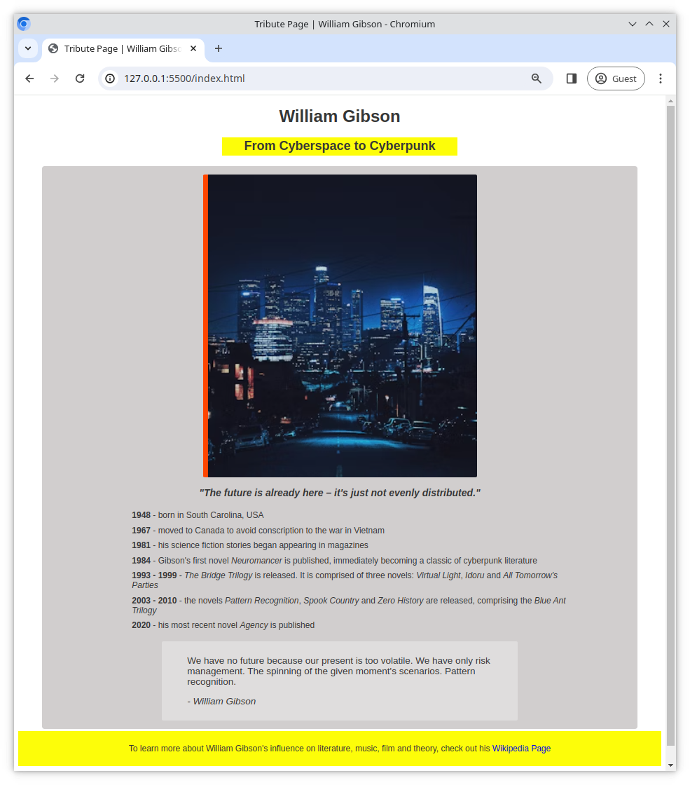

# Tribute Page

For this exercise you will make a simple page dedicated to someone or something that has had a positive influence on you.

## Task

Begin by creating an `index.html` and a `style.css` file in the root of the project folder.

## Requirements

The page should;

- include an image
- include a list, for example a list of dates (ordered or unordered)
- there should be at least one link
- use **semantic HTML** - `<header>`, `<main>`, `<footer>` etc.
- style the page to the best of your abilities
- make sure to properly use CSS properties such as `padding`, `margin`, `width` and `height`
- be creative!

### Example

Here is an example of how your site could look;

## Bonus Task

Publish your page on GitHub pages to share with everyone!
