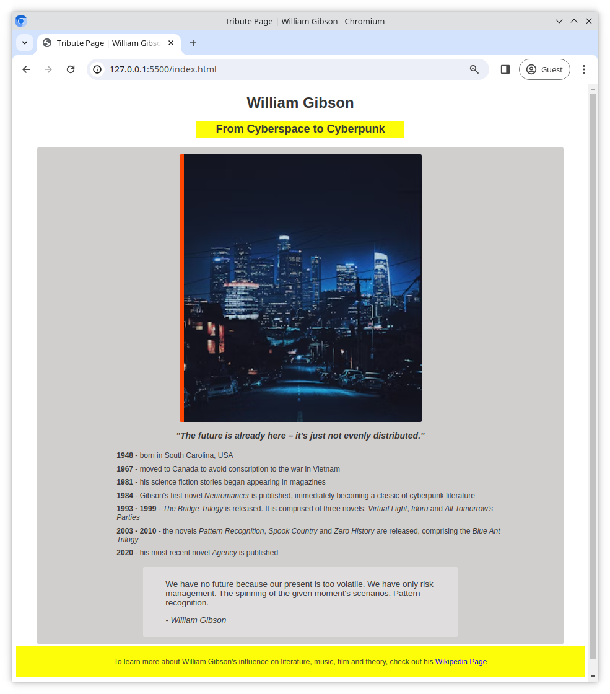

# Tribut Seite

In dieser Übung erstellst Du eine einfache Seite, die jemandem oder etwas gewidmet ist, das einen positiven Einfluss auf Dich hatte.

## Aufgabe

Beginne mit der Erstellung einer `index.html` und einer `style.css` Datei im Stammverzeichnis Deines Projektordners.

## Anforderungen

Die Seite sollte;

- ein Bild enthalten
- eine Liste enthalten, zum Beispiel eine Liste von Daten (geordnet oder ungeordnet)
- es sollte mindestens einen Link geben
- verwende **semantisches HTML** - `<header>`, `<main>`, `<footer>` etc.
- gestalte die Seite nach besten Kräften
- stelle sicher, dass Du CSS-Eigenschaften wie `padding`, `margin`, `width` und `height` richtig verwendest
- sei kreativ!

### Beispiel

Hier ist ein Beispiel, wie Deine Seite aussehen könnte;

## Bonus Aufgabe

Veröffentliche Deine Seite auf GitHub Pages, um sie mit allen zu teilen!
